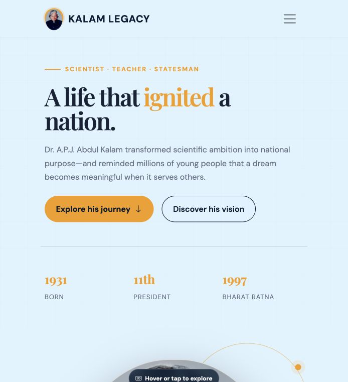
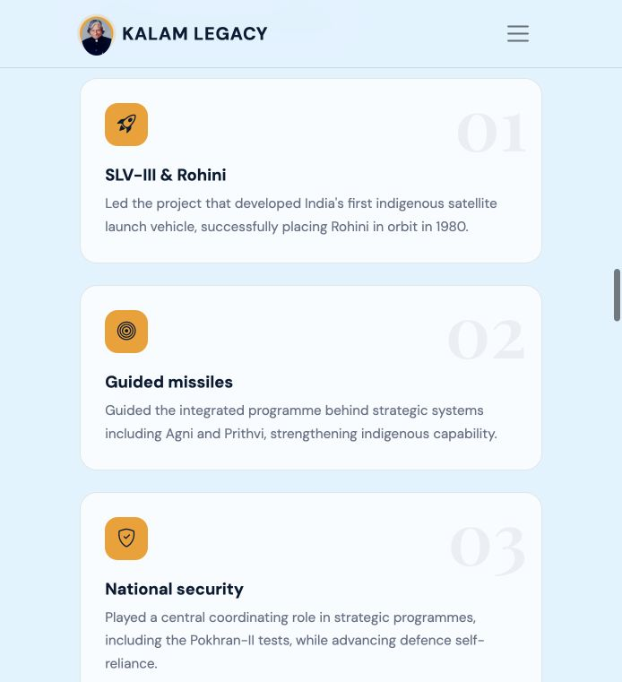

# Kalam Legacy

Kalam Legacy is a responsive tribute portfolio dedicated to **Dr. A.P.J. Abdul Kalam**—a scientist, teacher, author, and the 11th President of India.

The idea behind this webpage is to present his life and values as a clear visual journey. Instead of showing only a list of facts, the site connects his biography, scientific contributions, national vision, ethics, and books to explain why his legacy continues to inspire young people.

## Live website

[View Kalam Legacy on GitHub Pages](https://jithk03.github.io/Portfolio-APJ/)

## Screenshots

### Homepage



### Contributions



## Page journey

The content follows a simple storytelling flow:

1. **Home** — introduces Dr. Kalam and his enduring influence.
2. **Biography** — follows his journey from Rameswaram to Rashtrapati Bhavan.
3. **Contributions** — highlights his work with India's space and defence programmes.
4. **Vision** — presents his ideas for education, technology, youth, and national development.
5. **Ethics** — explores principles such as humility, service, responsibility, and perseverance.
6. **Books** — introduces some of his most influential writing.
7. **Honours and footer** — concludes with his national awards and trusted reference links.

## Interactive features

- Responsive Bootstrap navigation
- Smooth scrolling between sections
- Animated Kalam portrait in the navbar
- 3D-style main portrait gallery
- Multiple photographs that cycle on hover
- Tap support for mobile devices
- Keyboard controls using `Enter` or `Space`
- Reduced-motion support for accessibility
- Responsive layouts for desktop, tablet, and mobile

## Technologies

- HTML5
- CSS3
- JavaScript
- Bootstrap 5
- Bootstrap Icons
- Google Fonts

## Using the portrait gallery

Hover over Dr. Kalam's main portrait to activate the 3D tilt and cycle through the photographs. On a touchscreen, tap the portrait to start or stop the gallery. Keyboard users can focus the portrait and press `Enter` or `Space`.

## Run locally

Clone the repository and open `index.html` in a browser:

```bash
git clone https://github.com/jithk03/Portfolio-APJ.git
cd Portfolio-APJ
open index.html
```

No framework installation is required. An internet connection is needed for the Bootstrap, font, icon, and Wikimedia image resources.

## Sources and image credits

Biographical information is based on official profiles from the [President of India](https://presidentofindia.nic.in/dr-apj-abdul-kalam-profile) and [DRDO](https://drdo.gov.in/drdo/dr-apj-abdul-kalam).

Photographs are sourced from [Wikimedia Commons](https://commons.wikimedia.org/wiki/Category:Portraits_of_A._P._J._Abdul_Kalam), including Government of India images published under their stated licences.

## Purpose

This project was created for educational and commemorative purposes. It aims to help students and other visitors discover Dr. Kalam's achievements while reflecting on his belief that knowledge, character, and purposeful action can transform a nation.
